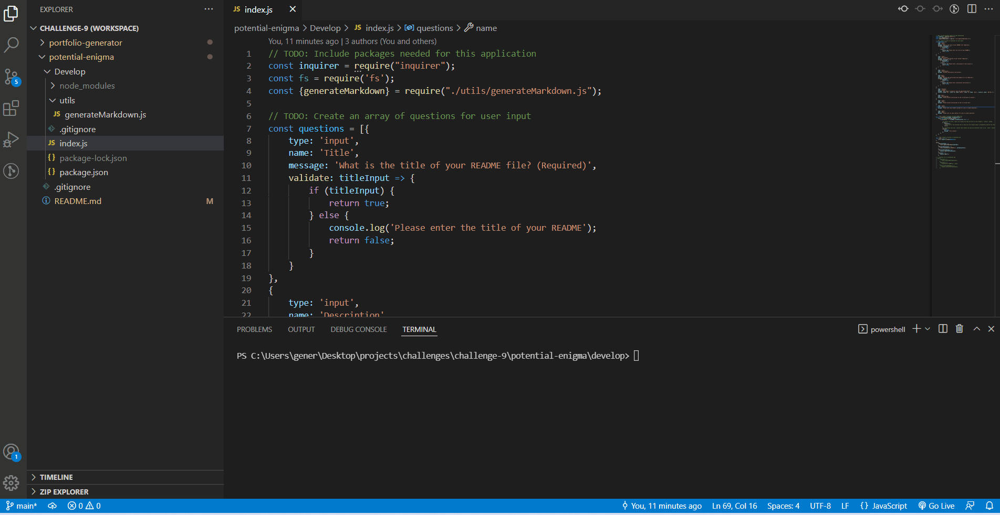

# Node Professional README Generator
 

## **Link** to web application: https://alinz07.github.io/readme-generator/ 

## **Link** to video walkthrough to demonstrate app functionality: https://watch.screencastify.com/v/ONT9WAKiyyEvPgwTlYEe 
## **Link** to project repository: https://github.com/alinz07/readme-generator
 

## **Motivation**
Create a command-line application that dynamically generates a professional README.md file from a user's input using the Inquirer package.

 

## **Table of Contents**
[How and Why?](#what-problem-does-this-solve-and-how-was-a-solution-accomplished)  
[Things I learned](#things-i-learned)  
[What makes this project stand out?](#what-makes-this-project-stand-out)  
[Challenge Criteria](#challenge-criteria) 
[Screenshot of Web Application](#screenshot-of-web-application) 
[How to Contribute](#how-to-contribute) 
[Credits](#credits) 
  
 

## **What Problem does this solve and how was a solution accomplished?**
Using command line prompts with node is a way to quickly and easily generate a high quality README.

I started by using the inquirer package to ask questions, return an answer object and then use a template literal in a separate javascript file to take that answer object and generate README markdown.

Everything else was more of the same: cleaning up the answer objects, accessing the data and using functions and template literals to generate markdown.
 

## **Things I learned**
* How to create an anchor link that jumps down to a section of the README.
* To navigate inquirer docs. I didn't want to write out a bunch of conditionals to generate a badge license, and learned from the docs that with a choices list answer object one can assign a name to display as well as an answer hash value to return. This way I could assign index values to iterate through when generating badges in the markdown with the renderLicenseBadge function.
* How to escape backticks in template literals to create codeblocks in the readme with triple backticks. Before each "extra" backtick I needed to add a backslash to escape the template literal.
 

## **What makes this project stand out?**

I'm proud of my use of answer object data combined with template literals. The code is efficient and I stuck to the general template that was provided with the starter code, including most of the parameters that were suggested.
 

## **Challenge Critera**
AS A developer
I WANT a README generator
SO THAT I can quickly create a professional README for a new project

GIVEN a command-line application that accepts user input 

* WHEN I am prompted for information about my application repository 
THEN a high-quality, professional README.md is generated with the title of my project and sections entitled Description, Table of Contents, Installation, Usage, License, Contributing, Tests, and Questions

* WHEN I enter my project title  
THEN this is displayed as the title of the README

* WHEN I enter a description, installation instructions, usage information, contribution guidelines, and test instructions
THEN this information is added to the sections of the README entitled Description, Installation, Usage, Contributing, and Tests

* WHEN I choose a license for my application from a list of options 
THEN a badge for that license is added near the top of the README and a notice is added to the section of the README entitled License that explains which license the application is covered under

* WHEN I enter my GitHub username 
THEN this is added to the section of the README entitled Questions, with a link to my GitHub profile

* WHEN I enter my email address 
THEN this is added to the section of the README entitled Questions, with instructions on how to reach me with additional questions

* WHEN I click on the links in the Table of Contents 
THEN I am taken to the corresponding section of the README
 

## **Screenshot of Web Application**

 

## **How to Contribute**
Please feel free to review, refactor and submit a pull request for additional features on my github page:  
https://github.com/alinz07 

### **Credits**
* Source code provided by University of Wisconsin-Milwaukee Extended Campus Full-Stack Coding Bootcamp